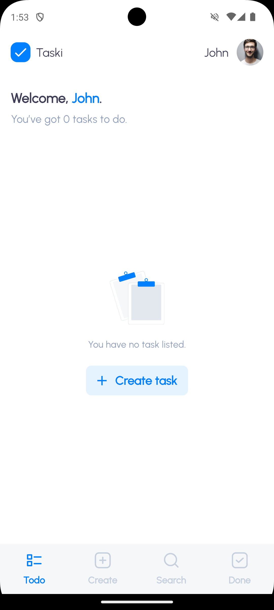
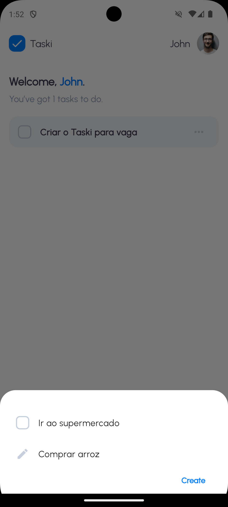
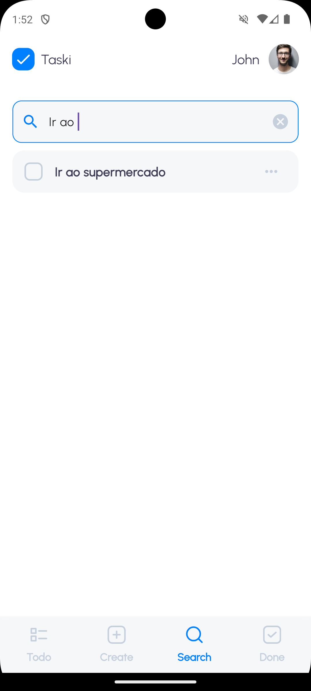
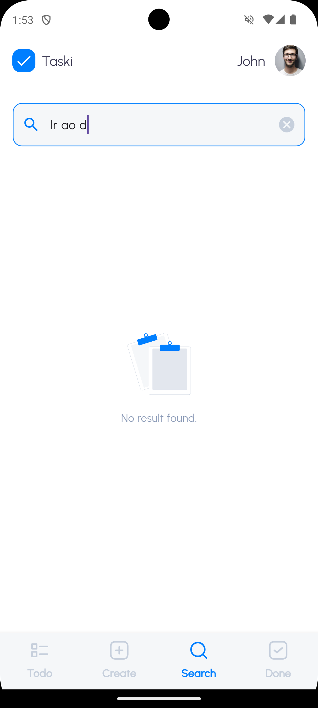
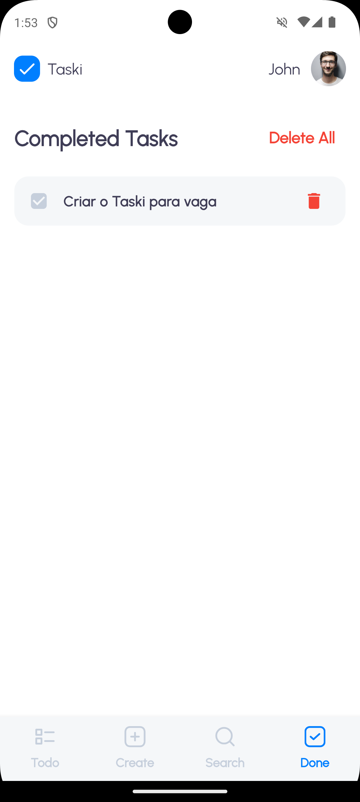

# 📌 MVVM Clean Architecture Flutter - Taski App

## 📖 Sobre o Projeto
Este é um aplicativo de lista de tarefas chamado **Taski** desenvolvido em **Flutter**, utilizando a arquitetura **MVVM + Clean Architecture** para garantir organização, escalabilidade e separação de responsabilidades. O app utiliza **Hive** como banco de dados local para armazenar as tarefas.


### 🔹 Screenshot
<p align="left">
   
   
   
</p>
<p align="left">
   
   
   
</p>


## 🚀 Como Executar o Projeto

### 🔹 Pré-requisitos
Antes de executar o projeto, certifique-se de ter:
- Flutter instalado ([Download Flutter](https://flutter.dev/docs/get-started/install))
- Dart SDK atualizado
- Dependências do projeto instaladas

### 🔹 Passos para rodar
1. Clone o repositório:
   ```sh
   git clone https://github.com/ThiagoOliveiira/taski.git
   cd taski
   ```
2. Instale as dependências:
   ```sh
   flutter pub get
   ```
3. Gere os adaptadores do Hive:
   ```sh
   dart run build_runner build --delete-conflicting-outputs
   ```
4. Execute o aplicativo:
   ```sh
   flutter run
   ```

## 🏗️ Estrutura do Projeto
A arquitetura segue o **MVVM + Clean Architecture**, garantindo separação de camadas e reutilização de código.

```
lib/
├── core/               # Camada central com classes auxiliares e de erro
│   ├── utils/         # Utilitários e constantes globais
│   ├── theme/         # Configuração do tema
|   ├── routes/        # Rotas do app com GoRouter
|   ├── database/      # Configuração do Hive 
│
├── data/               # Camada de dados (Repositórios e Models)
│   ├── datasources/   # Fonte de dados local (Hive)
│   ├── models/        # Modelos dos dados
│   ├── repositories/  # Implementação dos repositórios
│
├── domain/             # Camada de domínio (Regras de negócio)
│   ├── entities/      # Entidades principais do app
│   ├── repositories/  # Contratos dos repositórios
│   ├── usecases/      # Casos de uso do aplicativo
│
├── presentation/       # Camada de apresentação (UI e lógica da interface)
│   ├── viewmodel/     # Gerenciamento de estado com Cubit
│   ├── views/         # Telas do aplicativo
│   ├── widgets/       # Componentes reutilizáveis
│
├── main/factories      # Injeção de dependências e criação de objetos
│   │── main.dart      # Ponto de entrada do aplicativo
│  
├── routes/             # Configuração de rotas com GoRouter
│
```

## 🔹 Explicação das Camadas
- **Core**: Contém configurações globais, banco de dados, rotas do app e temas.
- **Data**: Implementa fontes de dados, repositórios e modelos que representam os dados do app.
- **Domain**: Contém entidades e regras de negócio, além dos casos de uso.
- **Presentation**: Responsável pela interface do usuário e gerenciamento de estado.
- **Factories**: Centraliza a criação de objetos, facilitando a injeção de dependências.
- **Routes**: Define as rotas do app utilizando **GoRouter**.

## 🔹 Funcionalidades
- ✅ Adicionar, atualizar e excluir tarefas ✅
- ✅ Filtrar tarefas concluídas e pendentes ✅
- ✅ Persistência de dados com **Hive** ✅
- ✅ Arquitetura modular **MVVM + Clean Architecture** ✅
- ✅ Gerenciamento de estado com **Cubit** ✅
- ✅ Navegação utilizando **GoRouter** ✅

## 📚 Tecnologias Utilizadas
- **Flutter**: Framework principal
- **Dart**: Linguagem de programação
- **Hive**: Banco de dados local
- **Cubit (Bloc)**: Gerenciamento de estado
- **GoRouter**: Navegação
- **Build Runner**: Geração de código para Hive

---
🚀 **Agora é só rodar o projeto e começar a usar!** 🚀

#
